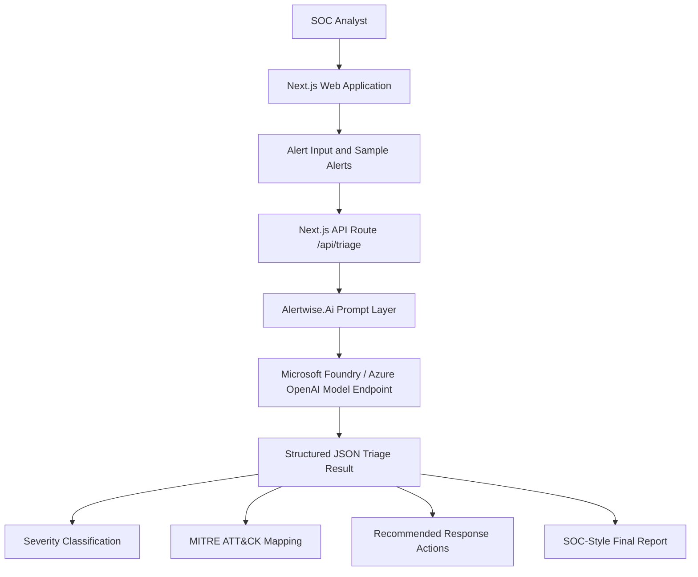

# Product Requirements Document (PRD)

# Alertwise.Ai — Cybersecurity Alert Triage Agent

## 1. Product Overview

**Product Name:** Alertwise.Ai  
**Project Type:** AI-powered cybersecurity alert triage agent  
**Hackathon Track:** Reasoning Agents  
**Target Users:** SOC analysts, junior cybersecurity analysts, incident responders, cybersecurity students, and security teams handling alert triage workflows.

Alertwise.Ai is an AI-assisted cybersecurity alert triage application that helps analysts review security alerts, classify severity, map suspicious activity to MITRE ATT&CK techniques, explain investigation reasoning, recommend response actions, and generate SOC-style incident reports.

The product is designed to support the first stage of security operations triage. It does not replace human analysts. Instead, it provides structured reasoning, investigation guidance, and report generation to help analysts work faster and more consistently.

---

## 2. Problem Statement

Security Operations Center (SOC) teams often receive large volumes of alerts from endpoint detection, SIEM, cloud security, identity, network, and email security tools. Many alerts are noisy, incomplete, or difficult for junior analysts to interpret quickly.

Common problems include:

- Alert fatigue from high alert volume.
- Inconsistent severity classification.
- Limited investigation guidance for junior analysts.
- Time-consuming manual report writing.
- Difficulty mapping raw alerts to MITRE ATT&CK techniques.
- Risk of overreacting to false positives or underestimating real threats.

Alertwise.Ai addresses these issues by providing a structured, AI-assisted triage workflow that explains its reasoning and highlights analyst validation requirements.

---

## 3. Product Goals

The main goals of Alertwise.Ai are:

1. Help analysts quickly understand suspicious security alerts.
2. Classify alert severity as Low, Medium, High, or Critical.
3. Map alert behavior to relevant MITRE ATT&CK techniques where possible.
4. Provide explainable reasoning rather than only a final answer.
5. Recommend practical incident response actions.
6. Include false positive considerations to reduce overconfidence.
7. Generate a concise SOC-style triage report.
8. Demonstrate responsible AI use in cybersecurity workflows.

---

## 4. Non-Goals

The first MVP version will not include:

- Full SIEM integration.
- Real-time log ingestion.
- Authentication or user management.
- Database storage.
- Multi-tenant support.
- Automated containment or remediation.
- Direct execution of security actions.
- Production-grade SOC deployment.

The MVP focuses on demonstrating a working AI triage agent with strong reasoning, safety, and a clean user experience.

---

## 5. Target Users

### 5.1 Junior SOC Analyst

A junior analyst receives alerts from a SIEM or EDR platform and needs help understanding what the alert means, how severe it is, and what investigation steps should be taken next.

### 5.2 Incident Responder

An incident responder uses the tool to quickly generate an initial incident summary and response checklist from raw alert details.

### 5.3 Cybersecurity Student or Career Starter

A cybersecurity learner uses the tool to understand how alerts are analyzed, how MITRE ATT&CK mapping works, and how SOC-style reports are structured.

### 5.4 Security Team Lead

A team lead uses the tool as a demonstration of how AI can support consistent first-level triage without replacing human judgement.

---

## 6. User Stories

### Core User Stories

1. As a SOC analyst, I want to paste a raw security alert so that I can receive a structured triage result.
2. As a junior analyst, I want the tool to explain why an alert is suspicious so that I can learn the reasoning process.
3. As an analyst, I want severity classification so that I can prioritize alerts.
4. As an analyst, I want MITRE ATT&CK mapping so that I can understand the likely attacker technique.
5. As an incident responder, I want recommended response actions so that I can decide the next investigation steps.
6. As a security team member, I want false positive considerations so that I do not overreact to incomplete evidence.
7. As an analyst, I want a final SOC-style report so that I can copy it into a case note or ticket.

---

## 7. MVP Scope

### 7.1 In Scope

The MVP will include:

- Single-page web application.
- Alert input text area.
- Sample alert buttons.
- AI-powered triage result.
- Severity badge.
- Confidence score.
- MITRE ATT&CK mapping section.
- Suspicious indicators section.
- Reasoning section.
- Recommended actions section.
- False positive considerations section.
- Final SOC-style report section.
- Safety notice stating that analyst validation is required.

### 7.2 Out of Scope

The MVP will not include:

- User login.
- Alert history.
- Database persistence.
- File upload.
- Live SIEM connection.
- Microsoft Sentinel API integration.
- Email notification.
- Automated endpoint isolation.
- Production deployment hardening.

---

## 8. Key Features

### 8.1 Alert Input

Users can paste raw alert text into a text area. The input may include:

- Alert name.
- Hostname.
- Username.
- Source IP.
- Destination IP.
- Process command line.
- Parent process.
- Event ID.
- Timestamp.
- File path.
- Detection name.
- Network behavior.

### 8.2 Sample Alert Library

The application will include sample alerts for demo purposes:

1. Suspicious PowerShell execution from Microsoft Word.
2. Multiple failed VPN login attempts.
3. Possible data exfiltration.
4. Suspicious new local administrator account.
5. Endpoint malware detection.

### 8.3 AI Triage Analysis

The AI agent analyzes the alert and returns structured JSON with:

- Severity.
- Confidence score.
- Short summary.
- MITRE ATT&CK techniques.
- Suspicious indicators.
- Reasoning.
- Recommended actions.
- Analyst notes.
- False positive considerations.
- Final SOC report.

### 8.4 Severity Classification

Severity must be classified as one of:

- Low
- Medium
- High
- Critical

Severity should be based on available evidence, not assumptions.

### 8.5 MITRE ATT&CK Mapping

The agent should map relevant behavior to MITRE ATT&CK techniques where possible. For example:

- T1059.001 — PowerShell
- T1110 — Brute Force
- T1041 — Exfiltration Over C2 Channel
- T1136 — Create Account
- T1204 — User Execution

If there is insufficient evidence, the agent should state that mapping is uncertain.

### 8.6 Reasoning Explanation

The agent must explain its reasoning clearly. The explanation should identify why specific evidence is suspicious, what information is missing, and how the analyst should validate the finding.

### 8.7 Recommended Response Actions

The agent should recommend practical actions such as:

- Isolate affected host.
- Preserve logs.
- Review process tree.
- Decode suspicious command.
- Check endpoint telemetry.
- Search for similar indicators.
- Review authentication logs.
- Validate user activity.
- Escalate to incident response if confirmed.

### 8.8 False Positive Considerations

The agent should include possible benign explanations. For example:

- Administrative scripts.
- Approved IT maintenance.
- Known software updater.
- User travel or VPN behavior.
- Security testing activity.

### 8.9 SOC-Style Final Report

The final report should be concise and structured so that an analyst can copy it into a ticket or case management tool.

---

## 9. Functional Requirements

| ID | Requirement | Priority |
|---|---|---|
| FR-001 | User can paste security alert text into the application. | Must Have |
| FR-002 | User can select a sample alert. | Must Have |
| FR-003 | User can submit alert for AI triage. | Must Have |
| FR-004 | System validates that alert input is not empty. | Must Have |
| FR-005 | System sends alert text to backend API route. | Must Have |
| FR-006 | Backend sends alert and system prompt to AI model endpoint. | Must Have |
| FR-007 | AI returns structured JSON output. | Must Have |
| FR-008 | UI displays severity, confidence, summary, MITRE mapping, reasoning, recommended actions, false positive notes, and final report. | Must Have |
| FR-009 | UI displays loading state during analysis. | Must Have |
| FR-010 | UI displays error message if analysis fails. | Must Have |
| FR-011 | Application includes safety disclaimer. | Should Have |
| FR-012 | User can copy final report. | Should Have |
| FR-013 | Application can be deployed publicly for demo. | Should Have |

---

## 10. Non-Functional Requirements

| ID | Requirement | Description |
|---|---|---|
| NFR-001 | Usability | The interface should be simple enough for a junior analyst to use without training. |
| NFR-002 | Performance | Triage response should return within a reasonable time for demo use. |
| NFR-003 | Reliability | The app should handle invalid input and failed AI responses gracefully. |
| NFR-004 | Security | API keys must be stored in environment variables and never committed to GitHub. |
| NFR-005 | Explainability | Output must include reasoning and analyst validation notes. |
| NFR-006 | Safety | The tool must not claim certainty when evidence is incomplete. |
| NFR-007 | Maintainability | Code should be organized into reusable components and typed interfaces. |

---

## 11. AI Agent Behavior Requirements

The AI agent must:

1. Analyze only the evidence provided in the alert.
2. Avoid inventing facts.
3. Clearly state when information is missing.
4. Use cautious language when confidence is limited.
5. Provide severity classification with reasoning.
6. Map to MITRE ATT&CK only when relevant.
7. Include false positive considerations.
8. Recommend analyst validation before action.
9. Return valid JSON only.
10. Avoid generating harmful offensive security instructions.

---

## 12. AI Output Schema

The AI response should follow this JSON structure:

```json
{
  "severity": "Low | Medium | High | Critical",
  "confidence": 0,
  "summary": "Short alert summary",
  "mitreTechniques": [
    {
      "id": "MITRE technique ID",
      "name": "Technique name",
      "reason": "Why this technique applies"
    }
  ],
  "indicators": [
    "indicator 1",
    "indicator 2"
  ],
  "reasoning": "Clear security reasoning based on the alert evidence",
  "recommendedActions": [
    "action 1",
    "action 2"
  ],
  "analystNotes": "Notes for analyst validation",
  "falsePositiveConsiderations": [
    "possible benign explanation 1"
  ],
  "finalReport": "Concise SOC-style triage report"
}
```

---

## 13. Example Input

```text
Alert: Suspicious PowerShell execution detected
Host: WIN-ENDPOINT-07
User: j.smith
Process: powershell.exe -nop -w hidden -enc SQBFAFgA
Parent Process: winword.exe
Source IP: 10.0.5.21
Timestamp: 2026-06-07 09:21:44
```

---

## 14. Example Expected Output

```json
{
  "severity": "High",
  "confidence": 86,
  "summary": "Suspicious PowerShell execution was launched from Microsoft Word using hidden window and encoded command parameters.",
  "mitreTechniques": [
    {
      "id": "T1059.001",
      "name": "PowerShell",
      "reason": "The alert shows PowerShell execution with suspicious command-line flags."
    },
    {
      "id": "T1204",
      "name": "User Execution",
      "reason": "The parent process winword.exe suggests possible execution through a document opened by the user."
    }
  ],
  "indicators": [
    "powershell.exe -nop -w hidden -enc",
    "Parent process: winword.exe",
    "Host: WIN-ENDPOINT-07",
    "User: j.smith"
  ],
  "reasoning": "The combination of Microsoft Word spawning PowerShell, hidden execution, and encoded command parameters is commonly associated with malicious macro or phishing-based execution. Additional telemetry is required to confirm payload behavior.",
  "recommendedActions": [
    "Isolate the endpoint if malicious activity is confirmed.",
    "Decode and inspect the PowerShell command.",
    "Collect PowerShell logs, Sysmon logs, and Office process tree evidence.",
    "Review email activity for suspicious attachments or links.",
    "Search for similar PowerShell command patterns across the environment."
  ],
  "analystNotes": "This alert should be validated using endpoint telemetry before containment action is taken.",
  "falsePositiveConsiderations": [
    "Legitimate administrative automation may use PowerShell.",
    "Security testing activity may generate similar command-line patterns."
  ],
  "finalReport": "Initial triage indicates suspicious PowerShell execution from Microsoft Word on WIN-ENDPOINT-07 under user j.smith. The command uses hidden execution and encoded parameters, raising concern for possible phishing-based code execution. Recommended next steps include decoding the payload, preserving endpoint logs, reviewing email activity, and searching for similar indicators. Analyst validation is required before escalation."
}
```

---

## 15. User Flow

1. User opens Alertwise.Ai web application.
2. User pastes a raw security alert or selects a sample alert.
3. User clicks **Analyze Alert**.
4. Application validates the input.
5. Backend sends the alert to the AI triage agent.
6. AI agent returns structured JSON.
7. UI displays the triage result in readable sections.
8. User reviews severity, reasoning, MITRE mapping, response actions, and report.
9. User copies final report if needed.

---

## 16. System Architecture



---

## 17. Proposed Tech Stack

| Layer | Technology |
|---|---|
| Frontend | Next.js, React, TypeScript |
| Styling | Tailwind CSS |
| Backend | Next.js API Route |
| AI Model | Microsoft Foundry / Azure OpenAI |
| Code Assistant | GitHub Copilot |
| Repository | GitHub |
| Deployment | Vercel |
| Diagram | Mermaid / draw.io / Excalidraw |

---

## 18. Project Folder Structure

```text
alertwise-ai/
├── app/
│   ├── page.tsx
│   ├── layout.tsx
│   └── api/
│       └── triage/
│           └── route.ts
├── components/
│   ├── AlertInput.tsx
│   ├── TriageResult.tsx
│   └── SampleAlerts.tsx
├── lib/
│   ├── prompt.ts
│   ├── sample-alerts.ts
│   └── types.ts
├── docs/
│   ├── PRD.md
│   ├── architecture.md
│   ├── demo-script.md
│   └── submission.md
├── public/
│   └── architecture-diagram.png
├── README.md
├── package.json
└── .env.example
```

---

## 19. UI Requirements

The UI should use a clean cybersecurity-style interface.

Recommended layout:

- Header with product name and short description.
- Alert input card.
- Sample alert buttons.
- Analyze button.
- Loading state.
- Result card with severity badge.
- MITRE ATT&CK mapping section.
- Reasoning section.
- Recommended actions checklist.
- False positive considerations.
- Final SOC report card.
- Safety disclaimer.

---

## 20. Safety and Responsible AI Requirements

Alertwise.Ai must clearly state:

- The tool provides AI-assisted analysis only.
- The output must be validated by a human analyst.
- The tool should not be used as the sole basis for containment, escalation, or disciplinary action.
- The agent should not provide offensive exploitation instructions.
- The agent should not claim certainty when telemetry is incomplete.

Suggested safety notice:

> Alertwise.Ai is designed to support cybersecurity analysts during initial triage. It does not replace human judgement. All AI-generated findings and recommendations should be validated using trusted security telemetry before action is taken.

---

## 21. Success Metrics

The MVP will be considered successful if:

1. A user can submit an alert and receive structured triage output.
2. The output includes severity, MITRE mapping, reasoning, response actions, and final report.
3. The application handles at least five sample alert scenarios.
4. The UI is clear enough for a demo video under five minutes.
5. The GitHub repository includes README, PRD, architecture notes, and setup instructions.
6. The demo clearly shows responsible AI use and analyst validation.

---

## 22. Demo Scenarios

### Scenario 1: Suspicious PowerShell

Demonstrates phishing-style execution from Microsoft Word to PowerShell.

### Scenario 2: VPN Brute Force

Demonstrates identity-based attack triage using failed login attempts and suspicious source IP.

### Scenario 3: Possible Data Exfiltration

Demonstrates unusual outbound transfer analysis.

### Scenario 4: Suspicious Local Admin Creation

Demonstrates account creation and privilege escalation triage.

### Scenario 5: Malware Detection

Demonstrates endpoint malware alert summarization and response guidance.

---

## 23. Hackathon Submission Checklist

Required submission items:

- [ ] Public GitHub repository.
- [ ] Working application.
- [ ] README.md.
- [ ] PRD.md.
- [ ] Architecture diagram.
- [ ] Demo video under five minutes.
- [ ] Project description.
- [ ] Clear explanation of Microsoft Foundry / Azure OpenAI usage.
- [ ] Clear explanation of GitHub Copilot usage.
- [ ] Responsible AI and safety statement.

---

## 24. Future Enhancements

Potential future improvements:

1. Microsoft Sentinel integration.
2. File upload for JSON, CSV, or Syslog alerts.
3. Alert history and case management.
4. Analyst feedback loop.
5. Risk scoring model.
6. Multi-alert correlation.
7. MITRE ATT&CK visual matrix.
8. Export to PDF or Markdown report.
9. Integration with Jira, ServiceNow, or GitHub Issues.
10. Role-based access control.

---

## 25. Risks and Mitigations

| Risk | Impact | Mitigation |
|---|---|---|
| AI produces incorrect severity | Analyst may over-prioritize or under-prioritize alert | Include confidence score and analyst validation notes |
| AI invents unsupported facts | Reduces trust | Prompt instructs model not to invent evidence |
| Output is not valid JSON | UI may break | Add backend error handling and JSON validation |
| API key exposure | Security risk | Store keys in environment variables only |
| Overly broad response actions | Could confuse users | Keep actions practical and evidence-based |
| Offensive security misuse | Safety concern | Restrict agent behavior to defensive triage |

---

## 26. Open Questions

1. Which Microsoft model endpoint will be used for the final demo?
2. Will the app be deployed publicly or shown locally during demo recording?
3. Should the final report include a copy button in MVP?
4. Should the project include a MITRE technique reference list locally?
5. Should sample alerts be synthetic only or include sanitized public examples?

---

## 27. Final MVP Definition

The MVP is complete when a user can open the app, select or paste a security alert, click analyze, and receive a structured AI-generated triage result containing severity, confidence, MITRE mapping, reasoning, recommended response steps, false positive considerations, and a SOC-style final report.

